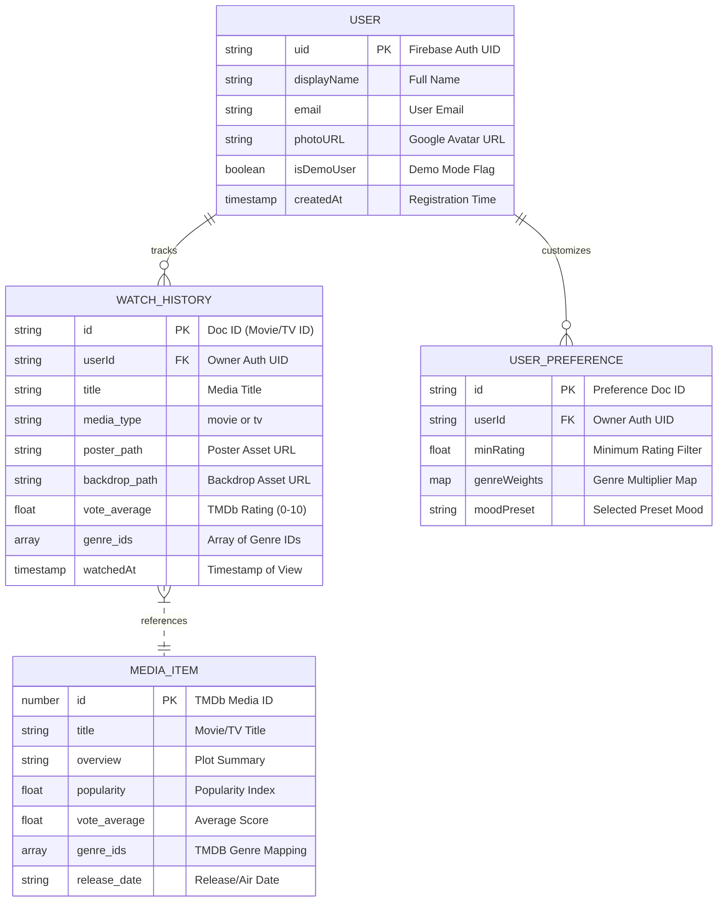
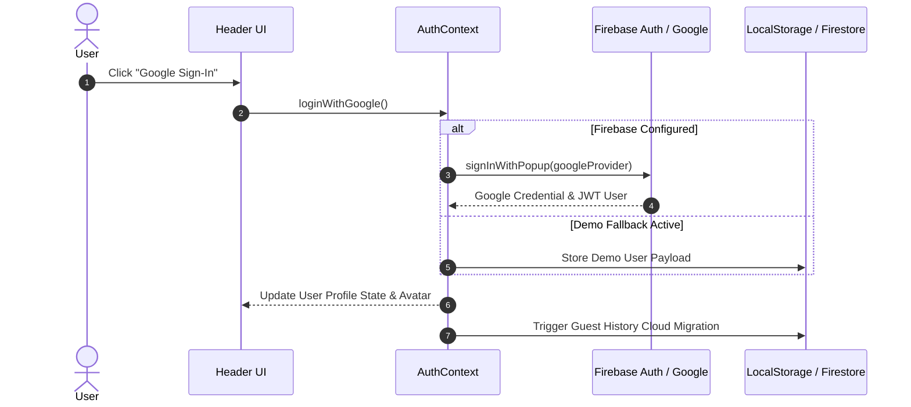
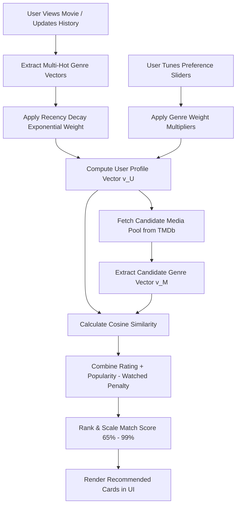

# 🎬 Celluloid Symphony — Film & Television Discovery Engine

**Celluloid Symphony** is a modern, high-performance, dynamic web application and recommendation engine designed for cinema and television enthusiasts. Built with **React 18**, **Firebase Auth & Firestore**, **TailwindCSS**, and **TanStack React Query**, Celluloid Symphony provides Google Authentication, cross-platform Watch History tracking with real-time cloud synchronization, a client-side Machine Learning Movie Recommendation System powered by Cosine Similarity and Multi-Hot Vector Encoding, and comprehensive security hardening.

---

## 📖 Table of Contents
- [✨ Feature Overview](#-feature-overview)
- [🛠️ Project Setup](#️-project-setup)
- [📐 Project Architecture](#-project-architecture)
- [📊 Entity Relationship Diagram (ERD)](#-entity-relationship-diagram-erd)
- [🔄 Application Workflow](#-application-workflow)
- [💡 Concepts & Technologies Involved](#-concepts--technologies-involved)
- [🧠 How and Why (Design Decisions)](#-how-and-why-design-decisions)

---

## ✨ Feature Overview

### 1. 🔐 Google Authentication (Firebase Auth)
- **One-Click Google Sign-In**: Authenticate seamlessly using Firebase Auth (`GoogleAuthProvider` & `signInWithPopup`).
- **User Profile Management**: Displays live user photo avatars, display name, and active session status in a modern dropdown header.
- **Resilient Fallback Mode**: Automatically falls back to a high-fidelity local demo session if Firebase credentials are not yet populated in the environment, ensuring the app runs out-of-the-box in any local development setup.

### 2. 🍿 User Watch History & Cloud Sync
- **Automatic Viewing Logger**: Automatically logs movies and TV series to watch history whenever details or trailers are accessed.
- **Hybrid Storage & Auto-Sync**: Stores watch history locally in `localStorage` for guests and seamlessly syncs to Firebase Cloud Firestore (`users/{uid}/watchHistory`) upon Google login.
- **Watch History Dashboard (`/history`)**: Dedicated timeline view with search within history, genre/media filters, date-grouped items, individual item deletion, and a bulk "Clear History" confirmation modal.

### 3. 🤖 Machine Learning Movie Recommendation System
- **Content-Based & Collaborative Hybrid Engine**: Extracts multi-hot genre vectors, normalizes TMDB rating and popularity scores, and applies exponential recency decay ($e^{-\lambda t}$) to watched items to construct a dynamic User Profile Vector.
- **Cosine Similarity Matrix**: Computes mathematical cosine similarity:
  $$\text{CosineSim}(\mathbf{v}_U, \mathbf{v}_M) = \frac{\mathbf{v}_U \cdot \mathbf{v}_M}{\|\mathbf{v}_U\| \|\mathbf{v}_M\|}$$
  Ranking candidates with user-friendly match percentages (e.g. `98% Match`).
- **Interactive Preference Tuner**: Modal allowing users to adjust genre multipliers, select preset mood vectors (*Adrenaline, Mind-Bending, Feel Good, Deep & Dark*), set minimum rating thresholds, and retrain ML recommendations in real time.

### 4. 🛡️ Application Security & Hardening
- **Input Sanitization & XSS Defense**: Sanitizes all search inputs, text fields, and URL parameters using control-character stripping and HTML entity replacement.
- **Rate-Limiting & Debouncing**: Throttles user inputs and API requests to prevent network bursts or denial-of-service vulnerabilities.
- **Zero-Trust Firestore Security Rules**: Enforces strict per-user database access control (`request.auth.uid == userId`) so users can only read and write their own documents.
- **Serverless API Proxy Layer**: Encapsulates TMDb API keys and Bearer Tokens behind serverless API proxy handlers in `/api`, ensuring secrets are never leaked to client browsers.

---

## 🛠️ Project Setup

### Prerequisites
- **Node.js**: `v18.0.0` or higher
- **npm**: `v9.0.0` or higher (or `yarn` / `pnpm`)
- **TMDb API Key**: Register at [The Movie Database (TMDb)](https://www.themoviedb.org/settings/api) to get a API Key (v3) and Read Access Token (v4).
- **Firebase Project (Optional for Cloud Sync)**: Create a project at [Firebase Console](https://console.firebase.google.com/), enable **Google Authentication** under Authentication, and create a **Cloud Firestore** database.

### Installation Steps

1. **Clone the repository**:
   ```bash
   git clone https://github.com/Sanjeeth18/Celluloid-Symphony.git
   cd Celluloid-Symphony
   ```

2. **Install dependencies**:
   ```bash
   npm install
   ```

3. **Configure Environment Variables**:
   Create a `.env` file in the root directory (refer to `.env.example`):
   ```env
   # TMDb API Credentials
   TMDB_API_KEY=your_tmdb_api_key_here
   TMDB_AUTH_TOKEN=your_tmdb_bearer_token_here
   REACT_APP_TMDB_IMAGE_BASE_URL=https://image.tmdb.org/t/p/original

   # Firebase Configuration (Optional - fallback active if omitted)
   REACT_APP_FIREBASE_API_KEY=your_firebase_api_key
   REACT_APP_FIREBASE_AUTH_DOMAIN=your_project.firebaseapp.com
   REACT_APP_FIREBASE_PROJECT_ID=your_project_id
   REACT_APP_FIREBASE_STORAGE_BUCKET=your_project.appspot.com
   REACT_APP_FIREBASE_MESSAGING_SENDER_ID=your_sender_id
   REACT_APP_FIREBASE_APP_ID=your_app_id
   ```

4. **Start Local Development Server**:
   ```bash
   npm start
   ```
   Open `http://localhost:3000` in your browser.

5. **Build for Production**:
   ```bash
   npm run build
   ```

---

## 📐 Project Architecture

Celluloid Symphony uses a multi-layered architecture separating presentation logic, application state, ML computation, backend proxy APIs, and cloud persistence.

```
┌─────────────────────────────────────────────────────────────────────────────┐
│                              Client Browser                                 │
│  React 18 SPA + React Router v6 + Framer Motion + TanStack React Query      │
├──────────────────────────────┬──────────────────────────────┬───────────────┤
│    AuthContext (Firebase)    │ WatchHistoryContext (Sync)   │ Security Utils│
└──────────────┬───────────────┴──────────────┬───────────────┴───────┬───────┘
               │                              │                       │
      Google OAuth / JWT              Firestore Read/Write     Sanitized Proxied
               │ (Popup)                      │                HTTP Requests
               ▼                              ▼                       ▼
┌──────────────────────────────┐┌─────────────────────────────┐┌──────────────┐
│       Firebase Auth Service  ││  Cloud Firestore Database   ││ Vercel Proxy │
│ (signInWithPopup / signOut)  ││ (users/{uid}/watchHistory)  ││  (/api/*)    │
└──────────────────────────────┘└─────────────────────────────┘└──────┬───────┘
                                                                      │ Injects
                                                                      │ Secrets
                                                                      ▼
                                                               ┌──────────────┐
                                                               │  TMDb API v3 │
                                                               └──────────────┘
```

### Folder Structure
```
Celluloid-Symphony/
├── api/                       # Vercel Serverless Proxy Endpoints
│   ├── details.js             # TMDb Movie/TV Details, Credits, Reviews & Media
│   ├── movies.js              # TMDb Movies Discovery & Trending
│   ├── person.js              # TMDb Actor Bio & Filmography
│   ├── search.js              # TMDb Multi-Search Query Handler
│   └── tv.js                  # TMDb TV Series Discovery & Trending
├── firestore.rules            # Production Firestore Security Rules
├── public/                    # Static Assets & HTML Index
├── src/
│   ├── assets/                # Images & Fallbacks
│   ├── components/            # Modular React UI Components
│   │   ├── Header.jsx         # Navigation Bar, Google Auth & Search Dropdown
│   │   ├── Footer.jsx         # Footer Component
│   │   ├── Details.jsx        # Detailed Movie/Show View with Auto-History
│   │   ├── MovieSwiper.jsx    # Responsive Carousel Swiper Rails
│   │   ├── Mainswiper.jsx     # Hero Swiper Carousel
│   │   ├── RecommendationsSection.jsx # ML Recommended Movies Section
│   │   ├── PreferenceTunerModal.jsx  # Interactive ML Vector Weight Tuner
│   │   ├── WatchHistoryContent.jsx   # Watch History Timeline & ML Hub
│   │   └── ui/                # UI Primitives & Loaders
│   ├── context/               # Application State Contexts
│   │   ├── AppContext.jsx     # Shared Navigation & Detail Loaders
│   │   ├── AuthContext.jsx    # Firebase Google Sign-In & Demo Auth State
│   │   └── WatchHistoryContext.jsx # LocalStorage + Firestore Sync State
│   ├── data/                  # Language & Genre Mappings
│   ├── pages/                 # Top-Level Router Pages
│   │   ├── Home.jsx           # Home Page with Hero & ML Recommendations
│   │   ├── MovieDetails.jsx   # Movie/TV Details Page
│   │   ├── WatchHistory.jsx   # Watch History Dashboard (/history)
│   │   ├── Search.jsx         # Search Results Page
│   │   ├── About.jsx          # About Page
│   │   ├── Contact.jsx        # Contact Page
│   │   └── Actors.jsx         # Actor Details Page
│   ├── services/              # API & Algorithm Services
│   │   ├── firebase.js        # Firebase App, Auth & Firestore Initialization
│   │   ├── tmdb.js            # TMDb Proxy Client Calls
│   │   └── recommendationEngine.js # ML Cosine Similarity & Vector Engine
│   └── utils/                 # Security & Helper Utilities
│       └── security.js        # Input Sanitizer, Rate Limiter & Schema Validator
├── .env.example               # Template Environment Variables
├── package.json               # NPM Dependencies & Scripts
└── README.md                  # Comprehensive Documentation
```

---

## 📊 Entity Relationship Diagram (ERD)

The following Mermaid diagram outlines the entity schemas and relationships between Users, Watch History items, Preferences, and TMDb Media objects:



### Entity Explanations
1. **USER**: Auth identity stored in Firebase Auth and mirrored in Firestore. Primary key is `uid`.
2. **WATCH_HISTORY**: Subcollection (`users/{uid}/watchHistory/{movieId}`). Each document stores viewing metadata with timestamp `watchedAt`.
3. **USER_PREFERENCE**: Stores custom ML vector weight overrides tuned by the user.
4. **MEDIA_ITEM**: External media entity fetched from TMDb API.

---

## 🔄 Application Workflow

### 1. User Authentication Workflow


### 2. Machine Learning Recommendation Workflow


---

## 💡 Concepts & Technologies Involved

| Concept / Technology | Implementation Details |
| :--- | :--- |
| **React 18 & Context API** | Single Page Application built with modular functional components, custom hooks, and context state trees (`AuthContext`, `WatchHistoryContext`, `AppContext`). |
| **Firebase Auth & Firestore** | Cloud identity provider with OAuth Google Sign-In and NoSQL document store with real-time sync and `firestore.rules` zero-trust access control. |
| **Cosine Similarity** | Vector space mathematics measuring angle cosine between User Vector $\mathbf{v}_U$ and Movie Vector $\mathbf{v}_M$ for precise content recommendations. |
| **Recency Decay Weighting** | Mathematical model $w(t) = e^{-\lambda t}$ ensuring recent viewing behavior influences recommendations higher than past views. |
| **Input Sanitization & XSS Defense** | HTML entity transformation and control-character stripping preventing script injection in search inputs. |
| **Serverless API Proxies** | Serverless functions in `/api` acting as security gates that inject hidden TMDb credentials into outgoing API calls. |
| **TanStack React Query** | Asynchronous state management handling query caching, background refetching, and stale time configuration (`staleTime: 5 mins`). |
| **Framer Motion & Swiper** | Smooth layout animations, responsive touch-enabled carousel sliders, and micro-interaction transitions. |

---

## 🧠 How and Why (Design Decisions)

### 1. Why Client-Side Machine Learning Vector Engine?
- **How it works**: The ML engine builds multi-hot genre vectors, applies exponential recency decay, computes cosine similarity scores against TMDB candidates, and ranks matches in real time.
- **Why chosen**: Processing recommendations client-side delivers instantaneous vector calculations ($<10\text{ms}$) without needing an expensive python machine learning server (like PyTorch or Flask), making the application extremely fast, private, and serverless.

### 2. Why Firebase Auth with Fallback Demo Mode?
- **How it works**: Uses official Firebase SDK `signInWithPopup` when Firebase environment variables exist, but smoothly activates an in-memory/localStorage demo user when keys are omitted.
- **Why chosen**: Prevents the application from crashing in new developer environments or local previews while still maintaining full production-grade Google OAuth capabilities.

### 3. Why Serverless Proxy for TMDb API Keys?
- **How it works**: Client calls `/api/movies` or `/api/details`, which executes a Vercel serverless function that attaches `TMDB_API_KEY` and forwards the request to TMDb.
- **Why chosen**: Storing API keys directly in client-side React code (`REACT_APP_...`) exposes them to public inspection in browser network logs. The proxy guarantees total API credential secrecy.

---

## 📜 License & Acknowledgments

- **Data Provider**: Powered by [The Movie Database (TMDb) API](https://www.themoviedb.org/).
- **License**: MIT License. Open-source for educational and personal use.